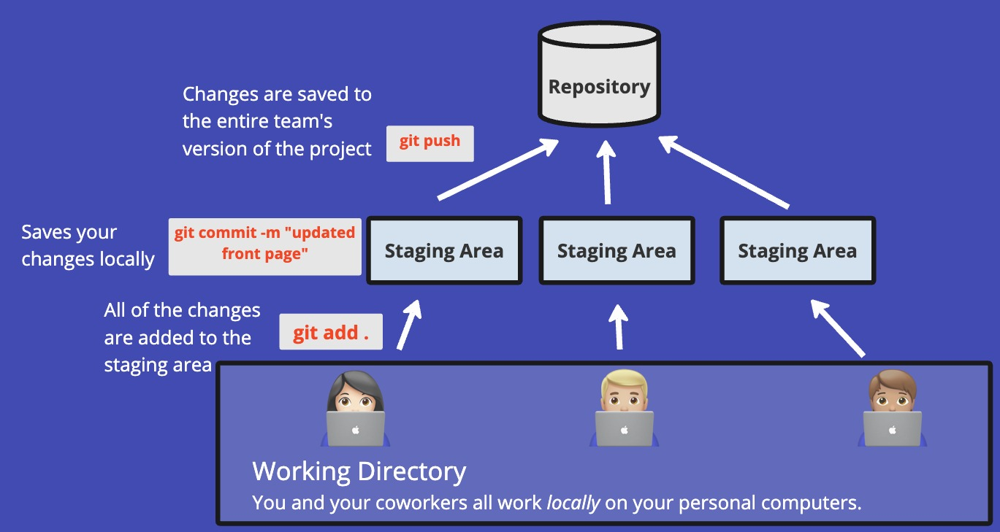

# Version Control
## What is version control?
Version control is **a system that records changes to a file or set of files over time** so that you can recall specific versions later. It's a critical tool in modern software development, allowing developers to work collaboratively, track every modification, and revert to previous states if necessary.

> **Example Scenario**
>
> Armine and Tigran are part of a software development team tasked with creating a new mobile application. Armine is tasked with refining the user authentication system, while Tigran is implementing an innovative feature that allows users to share media within the app.
>
> **Without Version Control**: If Armine and Tigran are editing the same file, Tigran's latest upload could accidentally overwrite the changes Armine made, resulting in a loss of progress and potential conflicts in the code.
>
> **With Version Control**: Armine and Tigran can work on their updates concurrently without the risk of interfering with each other's contributions. Here's how it unfolds:
>
> - Independently, they make their changes and commit their updates to the version control system, each creating a new version in the repository.
>
> - The version control system alerts them to the presence of new, separate updates, signaling that a merge of changes is necessary.
>
> - Together, they examine the differences, carefully integrate their respective code changes, and commit the unified version to the repository.
>
> - Should an issue arise with the authentication update, Armine can revert her portion of the code to a previous state without disrupting Tigran's feature, thanks to the version history maintained by the system.

A common tool for version control is GitHub. GitHub allows you acts as a central hub for all of the different versions of your code, kind of how in google docs you can see the history of your changes. Though there are many different systems for version control, we will be learning using GitHubs features. The syntax and user interface of different products are different, but the core elements are the same. 

## Fundamentals 
### What is a repository?
Repositories are like digital libraries where all the files for a specific project are stored. It is the central hub where the creator of the repository (also known as a repo) can decide who can edit and view the files. In GitHub you can create as many repositories as you want and you will be able to control the structure and workflow you want for your project or organization. 

### Creating & Editing a New Repository
Everything that is done to create or edit a repository can be done on the site itself, or through your terminal! To learn how to create or edit one, see the following GitHub Documentation:
- [Creating a Repository](https://docs.github.com/en/repositories/creating-and-managing-repositories/quickstart-for-repositories?tool=cli)
- [Cloning a Repository](https://docs.github.com/en/repositories/creating-and-managing-repositories/cloning-a-repository)
- [Adding a File to a Repo](https://docs.github.com/en/repositories/working-with-files/managing-files/adding-a-file-to-a-repository)

## Understanding Git Areas and Commands

### Working Directory

The **working directory** is where you actively work on the files in your project. It contains all the changes you've made.

**Relevant Commands:**
- `git status`: Show the status of changes as untracked, modified, or staged.
- `git checkout`: Switch between branches or revert changes to files in your working directory.

### Staging Area

The **staging area**, or "index," is a holding area for changes that are ready to be committed. It's where you prepare and review changes before they are committed to the repository.

**Relevant Commands:**
- `git add`: Add changes from the working directory to the staging area.

### Repository

The **repository** is where Git stores the history of your project. It contains all of your commits, each of which is a snapshot of your project at a point in time.

**Relevant Commands:**
- `git commit`: Commit your staged changes to the repository.
- `git log`: View the commit history of the repository.
- `git push`: Upload your local repository content to a remote repository.

### Command Workflow

1. Make changes in the **working directory**.
2. Use `git add` to select and move these changes to the **staging area**.
3. With `git commit`, save the changes from the staging area to your **repository**.
4. If using a remote repository, like on GitHub, `git push` shares your commits from the local repository to the remote.

## What is a Branch?

A **branch** in Git encapsulates an independent line of development, enabling you to work on new features, bug fixes, or experiments separately from the main codebase. It's akin to creating a parallel universe where you can make changes without affecting the 'main' or 'master' branch until you're ready to merge those changes back in.

### Purpose of Branching

Branching serves several purposes:

- **Isolation**: Each branch isolates development work from other branches in the repository. This isolation enables you to work on different tasks simultaneously without impacting the stability of the main codebase.
- **Collaboration**: Teams can collaborate on a project more effectively by using branches. Each team member can work on a specific branch without causing conflicts with others' work.
- **Parallel Development**: Branches enable concurrent development of multiple features, which can later be integrated into the main branch for release.
- **Experimentation**: You can experiment with new ideas in a branch without the risk of destabilizing the codebase. If the experiment fails, you can discard the branch without any impact.

### How Branching Works

Creating a branch in Git is a fast and simple operation because it doesn't copy files to the branch—instead, Git just creates a new pointer. Here's how you can work with branches:

- **Create a New Branch**: `git branch <branch-name>`
- **Switch to a Branch**: `git checkout <branch-name>`
- **Merge a Branch**: To incorporate changes from one branch into another, you merge them. For example, you might merge a feature branch into the main branch once the feature is complete.
- **Delete a Branch**: Once you've merged the changes and no longer need the branch, you can delete it with `git branch -d <branch-name>`.

By using branches, you can manage the development of new features, fixes, and updates in a structured and organized manner, allowing for a smoother and more controlled workflow.

## Branching Strategies

Branching in Git allows multiple developers to work on different tasks simultaneously without interfering with each other's work. Here are some common strategies:

- **Feature Branching**: Create branches for each new feature to keep changes isolated from the main codebase.
- **Release Branching**: Maintain separate branches for release candidates, allowing for bug fixes and preparation for a production release.
- **Hotfix Branching**: Quickly create branches to address urgent bugs in production code.

Each strategy serves a specific purpose and can be chosen based on the team's workflow and project requirements.

## Types of Merging

Merging is the process of integrating changes from one branch into another. Git offers several types of merges:

- **Fast-Forward Merge**: Moves the base branch pointer forward until it equals the feature branch's pointer.
- **Three-Way Merge**: Used when two branches have diverged. A new "merge commit" is created to join the two histories.
- **Squash Merge**: Combines all feature branch commits into a single commit for a cleaner history when merging into the base branch.

Understanding the implications of each merge type is crucial for maintaining a coherent project history.

## Important Concepts

Other intermediate concepts of version control include:

- **Pull Requests (PRs)**: PRs are a feature of hosting services like GitHub and GitLab. They let you tell others about changes you've pushed to a branch in a repository.
- **Workflows**: Workflows like Gitflow and GitHub Flow offer structured methods for branching and merging that fit different types of projects and development cycles.
- **Rebasing**: Rebasing is an alternative to merging, rewriting the commit history to produce a straight, linear progression of changes.
- **Stashing**: Save uncommitted changes in a stack while you switch branches.

By mastering these concepts, developers can collaborate more effectively and maintain a clean, functional codebase.

  
Sources

