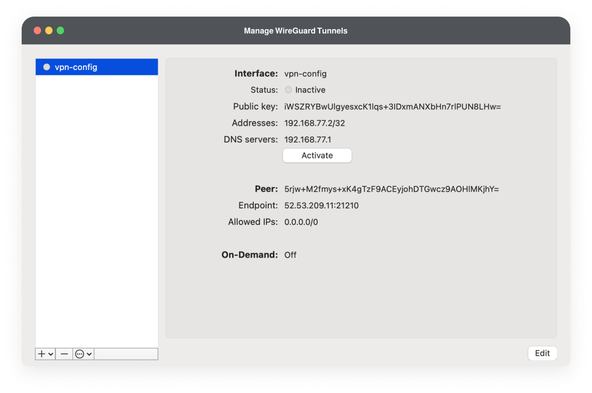

# Lab 2 - Accessing Corporate Network and AWS ECR
**Estimated Time to Complete:** 30-45 minutes
{: .label .label-blue }

{: .info}
Before you begin the lab exercise, please check the **Labs Overview** page to ensure that you have all the required software installed and that you meet all the prerequisites.

## Learning Objectives
- Establish a VPN connection to access the corporate internal network.
- Use internal services to generate temporary AWS IAM credentials.
- Authenticate and push Docker images to a company-shared AWS Elastic Container Registry (ECR).
- Demonstrate understanding of AWS IAM roles and permissions by using an assumed role for Docker operations.

## Introduction
**This lab simulates a common industry practice where developers need to access corporate resources securely via a VPN.** You'll will be using the internal services available to generate temporary credentials for AWS services, allowing you to push Docker images to a company-shared AWS Elastic Container Registry (ECR).

## Accessing the Corporate Network via VPN

{: .warning}
This lab requires the lab infrastructure to be set up by an instructor or administrator. Independent learners should refer to the [lab setup guide](../../../../lab-setup-guide/) to configure this environment accordingly.

**VPN Configuration and Connection:**
- Download the VPN configuration file from `https://{public_ip}`. _Ask the lab administrator for the public ip of the internal network, and replace the `{public_ip}` placeholder._

{: .info}
When you access the website using the public IP, you may encounter a security warning in your browser that states **Your connection is not private**. This warning appears because the site is using a **self-signed SSL certificate** rather than one issued by a recognized Certificate Authority. They offer the same level of encryption but are not verified by a third-party authority that your browser trusts by default ([Learn more here](https://en.wikipedia.org/wiki/Self-signed_certificate)). Click on "Advanced" or "Show Details" and proceed to the website (The exact wording may vary depending on your browser).

- Import the VPN configuration file into the Wireguard Client to establish the VPN connection. This step provides access to internal services.




**Navigate to the Dashboard:**
- With the VPN connection established, access `http://dashboard.internal` on your browser. This internal service dashboard is your gateway to various corporate resources.


## Generating Temporary AWS IAM Credentials

### Credential Generation
- On the dashboard, use the _AWS IAM Assume Role_ credential generator. This utility provides you with temporary credentials granting limited access to AWS services.
- Note down the generated Access Key ID, Secret Access Key, and Session Token.

### Configure AWS CLI with Temporary Credentials
- Run `aws configure` to input the temporary credentials. When prompted, enter the Access Key ID, Secret Access Key, and specify the default region `us-west-1`. For the output format, you can choose `json`.
- Now, we need to add the _AWS Session Token_ as part of the credential configuration. When you used the AWS IAM Assume Role credential generator, it provided temporary security credentials that include a Session Token. Failure to include the Session Token will result in AWS rejecting requests made with these credentials

**For MacOS/Linux:**
Run the following commands to add the temporary credentials to your AWS credentials file:
```bash
echo "aws_session_token = YOUR_SESSION_TOKEN" >> ~/.aws/credentials
```

**For Windows:**
Run the following commands to add the temporary credentials to your AWS credentials file:
```bash
echo aws_session_token=YOUR_SESSION_TOKEN >> %USERPROFILE%\.aws\credentials
```


## Interacting with AWS ECR
AWS Elastic Container Registry (ECR) is a managed Docker container registry service that makes it easy for developers to share Docker container images.

### Creating an Image Repository
**In AWS ECR, each Docker image is stored in a repository**, which acts as a collection or a namespace for your Docker images. Let's create a repository where you can push and share your Docker image.

```bash
aws ecr create-repository --repository-name <repository-name>
```

{: .warning}
When creating a new repository, it's important to choose a unique name. If you try to create a repository with a name that already exists within the AWS account in the same region, AWS will throw a `RepositoryAlreadyExistsException`. You can use the `aws ecr describe-repositories` command to list all available repositories.

### Authenticate Docker Client to AWS ECR
Authenticate your Docker client to the AWS ECR service to enable pushing and pulling images.

```bash
aws ecr get-login-password | docker login --username AWS --password-stdin <shared-registry-url>
```
`<shared-registry-url>` can be found in the internal dashboard.

### Tag and Push Your Docker Image
Tag your local Docker image with the ECR repository URI

```bash
docker tag my-app <shared-registry-url>/<repository-name>
```

After tagging, push your Docker image to the AWS ECR repository

```bash
docker push <shared-registry-url>/<repository-name>
```

## Managing Docker Images Locally and Pulling from AWS ECR (Buddy Activity)
Okay, now that your image is successfully pushed to the company's shared registry, it's accessible to anyone with the right permissions within your organization.

### Pulling the Docker Image from AWS ECR
Let's try pulling a repository of your classmate's image from the shared AWS ECR. You can obtain the names of their Docker images stored in AWS ECR by either asking directly or using an AWS CLI command to list all available repositories `aws ecr describe-repositories`.

Once you have the repository name, proceed to pull.
```bash
docker pull <shared-registry-url>/<repository-name>
```

Check the Docker images currently stored on your machine.
```bash
docker images
```

After pulling the image, run it locally to see the application your classmate developed!

{: .warning}
Don't forget to deactivate your VPN connection after you have completed the lab exercise!