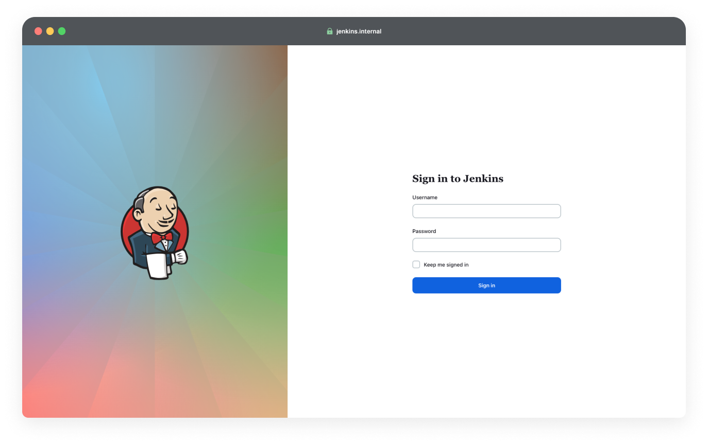

**Estimated Time to Complete:** 60 minutes
{: .label .label-blue }

{: .info}
Before you begin the lab exercise, please check the **Labs Overview** page to ensure that you have all the required software installed and that you meet all the prerequisites.

## Introduction
In this lab, you will automate the process of building, and deploying a Dockerized application using Jenkins. Building upon the manual processes you learned in Chapter 3, you will create a very simple Jenkins pipeline that automates these tasks.

This exercise aims to demystify the CI/CD process, helping you better visualize the workflow from building an application to its deployment. **It's important to note that CI/CD pipelines in real-world scenarios involve more complexity and other CI/CD tools might use different syntax for defining pipelines.** However, understanding this basic structure will equip you with the fundamental knowledge required to grasp more complex workflows in the industry.

## Accessing the Corporate Network via VPN

{: .warning }
This lab requires the lab infrastructure to be set up by an instructor or administrator. Independent learners should refer to the [lab setup repository](../../../../lab-setup-guide/) to configure this environment accordingly.


**VPN Configuration and Connection:**
- Download the VPN configuration file from `https://{public_ip}`. _Ask the lab administrator for the public ip of the internal network, and replace the `{public_ip}` placeholder._

{: .info}
When you access the website using the public IP, you may encounter a security warning in your browser that states **Your connection is not private**. This warning appears because the site is using a **self-signed SSL certificate** rather than one issued by a recognized Certificate Authority. They offer the same level of encryption but are not verified by a third-party authority that your browser trusts by default ([Learn more here](https://en.wikipedia.org/wiki/Self-signed_certificate)). Click on "Advanced" or "Show Details" and proceed to the website (The exact wording may vary depending on your browser).

- Import the VPN configuration file into the Wireguard Client to establish the VPN connection. This step provides access to internal services.


## Accessing Jenkins
Once you're connected to the VPN, navigate to `http://jenkins.internal` in your browser to access the Jenkins dashboard. _Ask the lab administrator for the credentials for jenkins._ 


## Creating a Pipeline in Jenkins
- Create a New Item: From the Jenkins dashboard, select "New Item" at the top left.
- Name Your Pipeline: Enter a name for your project, and select "Pipeline" as the type.

**Configure the Pipeline:**

In the General section, choose "GitHub project" and enter the GitHub repository URL.
- If you haven't already from the previous lab, fork the reference application repository and enter the forked repo URL.

In the Pipeline section, choose "Pipeline script from SCM" for the Definition.
- Select "Git" as the SCM.
- Enter the repository URL of your forked version of the reference application.
- Change Branch Specifier from `*/master` to `*/main`.

Click `apply` and `save`.

## Setting Up Webhooks
Webhooks allow GitHub to notify Jenkins about code changes, triggering the pipeline we have created.

**Configure Webhooks:**
- Go to your forked repository on GitHub, navigate to "Settings" > "Webhooks" > "Add webhook."
- Enter the URL provided on the `http://dashboard.internal` page into the Payload URL in GitHub Webhooks creation page.
- Select `application/json` as the Content Type.
- Save your webhook. This setup ensures Jenkins is notified on every code push, automating the build process.


## Creating the Jenkinsfile
We're now going to create a Jenkinsfile. 

Written in Groovy, Jenkinsfile provides a declarative way to to define our CI/CD Pipeline, automating the steps we manually performed in Chapter 1.

**Declarative Pipeline Syntax**

Jenkinsfiles typically use a declarative syntax that outlines the pipeline in sections like `pipeline`, `agent`, `stages`, `stage`, and `steps` [More Information can be found in Jenkin's Documentation](https://www.jenkins.io/doc/book/pipeline/syntax/#declarative-sections). 

**Pipeline and Agent**

All declarative pipelines are enclosed within a pipeline block. `agent` specifies where this pipeline will be executed. Let's keep this simple and tell Jenkins that it can use any available agent to run the pipeline.

```groovy
pipeline {
    agent any
}
```

**Stages**

Now, we're going to use `stages` to include a sequence of one or more `stage` directives to define what work will be done in the pipeline.

```groovy
pipeline {
    agent any

    stages {
        // each stage goes in this block
    }
}
```

**Stage 1: Checkout**

In this stage, we will tell Jenkins to grab the latest version of our code from the repository we specified earlier in the Jenkins UI.

```groovy
stage('Checkout') {
    checkout scm
}
```

**Stage 2: Build**

Now that Jenkins has the codebase with the Dockerfile, we're going to ask it to build a Docker image. The `sh` is our way of telling Jenkins to execute the specified _shell_ command.

```groovy
stage('Build') {
    sh 'docker build . -t $AWS_ACCOUNT_ID.dkr.ecr.$REGION.amazonaws.com/<image-name>'
}
```

- The `<image-name>` is where you specify your container image name.

{: .info }
> Remember how in [Chapter 1](https://github.com/open-devsecops/course/blob/master/topic-2-cicd/chapter-1-containerization/lab/lab1.md#building-your-docker-image), we used the Docker CLI to build our image manually? This command is essentially automating that process.

**Stage 3: Push Image**

With our Docker image built, it's time to push the image to a shared registry.

```groovy
stage('Push Image') {
    steps {
        sh 'aws ecr get-login-password --region $REGION | docker login --username AWS --password-stdin $AWS_ACCOUNT_ID.dkr.ecr.$REGION.amazonaws.com'
        sh 'aws ecr describe-repositories --repository-names <image-name> || aws ecr create-repository --repository-name <image-name>'
        sh 'docker push $AWS_ACCOUNT_ID.dkr.ecr.$REGION.amazonaws.com/<image-name>'
    }
}
```

In the second shell command, we check whether the specified AWS ECR repository already exists. If it doesn't, we automatically create it using `aws ecr create-repository`.

{: .info }
> Using a shared registry is crucial because the image we've built needs to be accessible across different stages of the pipeline and potentially by different agents or nodes that might run these stages. These agents could be spread across various environments in the Cloud.

**Stage 4: Deploy**

Finally, we reach the deploy stage. This is where we take our Docker image and run it, making our application live and accessible to the world!

```groovy
stage('Deploy') {
    steps {
        sh 'docker pull $AWS_ACCOUNT_ID.dkr.ecr.$REGION.amazonaws.com/<image-name>'
        sh 'docker rm -f <container-name> || true'
        sh 'docker run -d -p "<host-port>:80" --name <container-name> $AWS_ACCOUNT_ID.dkr.ecr.$REGION.amazonaws.com/<image-name>'
    }
}
```

- The `<container-name>` is where you specify the name for your running container. 
- The `<host-port>` is where you specify the port on the host machine, which is used to forward traffic to port 80 of the running container.

{: .warning}
> When specifying `<host-port>`, please choose a port number between 2000 and 3000 unless specified otherwise by your administrator. This range is allowed through the firewall, ensuring your deployed application is accessible on the Internet.

{: .info }
> Think back to when you built, pushed, pulled, and ran your container locally in Chapter 3. Now, we've automated this step to occur in a potentially different environment, demonstrating the power of CI/CD.


### The Complete Jenkinsfile

```groovy
pipeline {
    agent any
    
    stages {
        stage('Checkout') {
            steps {
                checkout scm
            }
        }
        stage('Build') {
            steps {
                sh 'docker build . -t $AWS_ACCOUNT_ID.dkr.ecr.$REGION.amazonaws.com/<image-name>'
            }
        }
        stage('Push Image') {
            steps {
                sh 'aws ecr get-login-password --region $REGION | docker login --username AWS --password-stdin $AWS_ACCOUNT_ID.dkr.ecr.$REGION.amazonaws.com'
                sh 'aws ecr describe-repositories --repository-names <repository-name> || aws ecr create-repository --repository-name <repository-name>'
                sh 'docker push $AWS_ACCOUNT_ID.dkr.ecr.$REGION.amazonaws.com/<image-name>'
            }
        }
        stage('Deploy') {
            steps {
                sh 'docker pull $AWS_ACCOUNT_ID.dkr.ecr.$REGION.amazonaws.com/<image-name>'
                sh 'docker rm -f <container-name> || true'
                sh 'docker run -d -p "<host-port>:80" --name <container-name> $AWS_ACCOUNT_ID.dkr.ecr.$REGION.amazonaws.com/<image-name>'
            }
        }
    }
}
```

## Seeing the CI/CD pipeline in Action
After creating the Jenkinsfile, it's time to see the CI/CD pipeline in action!

1. Commit and push your Jenkinsfile if you haven't already
2. Make some changes to your application.
3. Push your changes to the remote repository. This will signal Jenkins to initiate the pipeline, thanks to the webhook you've set up previously.
4. Navigate to the Jenkins dashboard `http://jenkins.internal` and observe the pipeline you configured starting to run automatically.


Once the pipeline completes, view you application at the following url!

```
http://{public_ip}:{host_port}
```

Replace `{public_ip}` with the public IP address, and `{host_port}` with the specific port number you've chosen during the deployment stage in the Jenkinsfile.

{: .warning}
Don't forget to deactivate your VPN connection after you have completed the lab exercise!