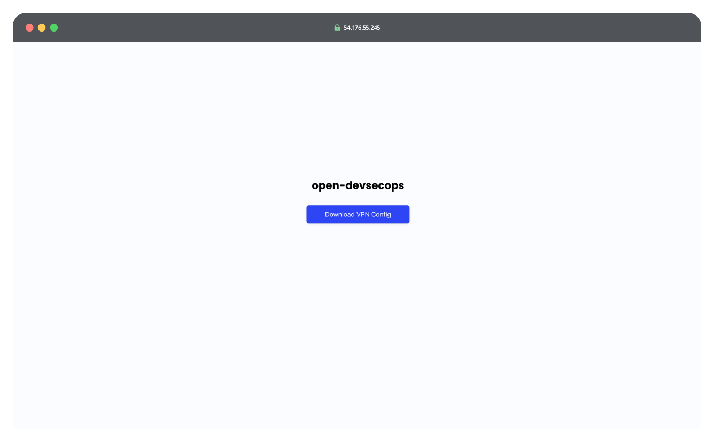
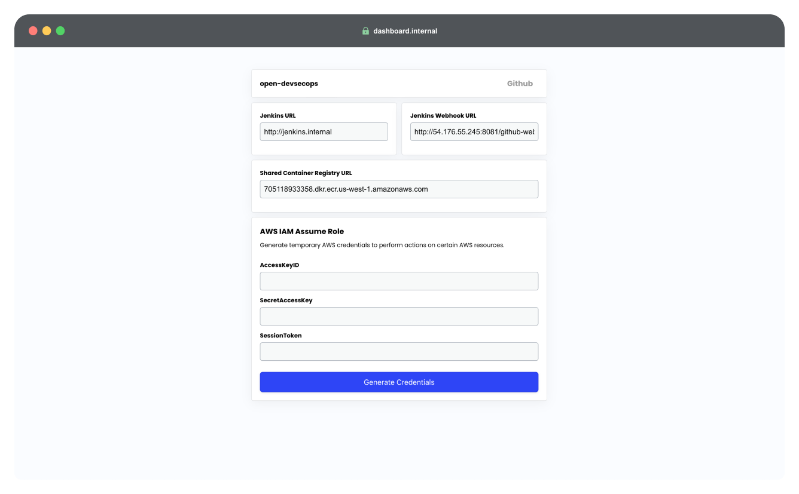
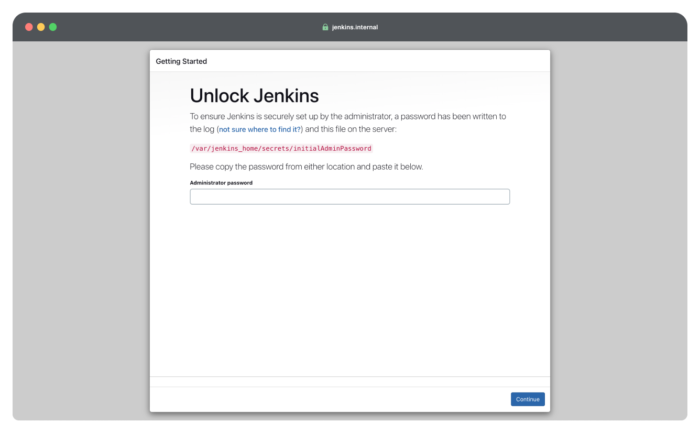

# DevOps Lab Infrastructure Setup Guide on AWS

This guide provides detailed instructions for setting up the necessary infrastructure on AWS to support the CI/CD labs in our curriculum. By following this guide, educators and learners will be able to prepare a robust environment for hands-on practice with continuous integration and continuous delivery.

## Prerequisites

Before setting up the infrastructure for the CI/CD labs on AWS, ensure that you have the following tools installed and configured on your machine. These tools are necessary for interacting with AWS services and for deploying and managing the infrastructure.

### Software Requirements

| Name       | Purpose  | Installation Guide |
| ---------- | -------- | ------------------ |
| AWS CLI    | To interact with Amazon Web Services. | [Guide Link](https://docs.aws.amazon.com/cli/latest/userguide/getting-started-install.html){: .btn .btn-purple } |
| Terraform  | To provision AWS Infrastructure consistently and programmatically. | [Guide Link](https://developer.hashicorp.com/terraform/tutorials/aws-get-started/install-cli){: .btn .btn-purple } |
| Git        | To clone the infrastructure scripts. | [Guide Link](https://git-scm.com/book/en/v2/Getting-Started-Installing-Git){: .btn .btn-purple } |
| WireGuard Client | To access internal services. | [Guide Link](https://www.wireguard.com/install/){: .btn .btn-purple } |


### Other Requirements
**Active AWS Account**: You need an active AWS account to provision AWS services. You will be billed accordingly for the AWS resources utilized during the labs.

<hr>

## Configuring AWS CLI

### Obtain Access Credentials
1. Log into your AWS Management Console.
2. Navigate to `IAM > Users`.
3. Click `Create user`.
4. Enter the desired user name, click next, and attach the `AdministratorAccess` policy.
5. Click on the new user that you created, navigate to the `Security credentials` tab, and click `Create access key`.
6. Generate a new access key for the Command Line Interface user case. Make sure to save these credentials securely.

### Configure the AWS CLI
1. Open your terminal.
2. Run the following command:
```bash
aws configure
```
3. Enter the Access Key ID and Secret Access Key when prompted.
4. Specify the default region (e.g., `us-west-1`). This should be the region where you will deploy the resources.

## Setting Up the Infrastructure with Terraform
With the AWS CLI configured, the next step is to set up the actual lab infrastructure using Terraform. Terraform will allow you to automate the deployment of all required AWS resources.

### Clone the Infrastructure Setup Scripts
1. Open your terminal.
2. Run the following command to clone the lab infrastructure setup repository. This repository contains all the necessary Terraform scripts for various lab topics.
```bash
git clone https://github.com/open-devsecops/lab-infra-setup.git
```

3. Change into the directory containing the Terraform scripts for Topic 3 DevOps lab:
```bash
cd lab-infra-setup/topic-2-devops/aws
```

### Initialize Terraform
1. Within the Topic 2 - DevOps directory, initialize Terraform to install necessary providers and set up your environment.
2. In the terminal, enter the following:
```bash
terraform init
```

3. Before applying any changes, review what Terraform intends to do. This command will show you a list of resources that Terraform plans to create.
```bash
terraform plan
```

4. Apply the configuration to begin provisioning the AWS resources.
```bash
terraform apply
```

5. When prompted to `Enter a value:`, enter `yes`.

6. After Terraform successfully applies the configuration, it will output important information such as public IPs, or other commands and other data needed to access your resources.

| Output Name | Description | Usage |
| ----------- | ----------- | ----- |
| SSH	      | SSH command to access the EC2 instance.	| Use this command to SSH into the EC2 instance for administrative tasks or troubleshooting. |
| ec2_public_ip | The public IP address of the EC2 instance. | Needed to access various web interfaces for the lab, such as downloading VPN configurations, accessing Jenkins, etc. |

{: .warning }
**Please allow sufficient time for tools to install.** After Terraform successfully provisions the AWS resources, it typically takes about 5 minutes for all software tools to be fully installed and operational on the provisioned resources. You can verify completion by entering in the terminal `[ssh command] -f "grep 'Lab Infrastructure Provisioning Complete' /var/log/cloud-init-output.log"`.

## Accessing Internal Services

### Use the VPN Config Generator
1. Navigate to the VPN Config Generator at `https://{ec2_public_ip}`. Replace `{ec2_public_ip}` with the actual public IP address output by Terraform.

2. Download the VPN Configuration file
3. Import the VPN Configuration file into your WireGuard client.
4. Activate the VPN connection using WireGuard to securely connect to the internal network.
5. Access internal services such as `http://dashboard.internal` or `http://jenkins.internal`.



## Configuring Jenkins
Once your infrastructure is ready and you have connected to the internal network via VPN, you can proceed to set up Jenkins for the DevOps labs.

1. Navigate to `http://jenkins.internal` in your web browser.

2. To unlock Jenkins and begin setup, you need the initial admin password. Use the command below to retrieve this.
```bash
[ssh command] -f "sudo docker exec jenkins cat /var/jenkins_home/secrets/initialAdminPassword"
```
3. Back in your web browser on the Jenkins unlock page, enter the initial admin password you retrieved to unlock 4. Select the option to Select Plugins to Install.
5. Choose GitHub from the list of available plugins.
6. Click Install to start the plugin installation process.
7. Once the plugin installation is complete, proceed to the Create First Admin User step.
8. Fill out the form with the admin username, password.
9. On the Instance Configuration page, ensure the Jenkins URL is set to http://jenkins.internal/. This should be populated automatically.
10. Click Save and Finish.